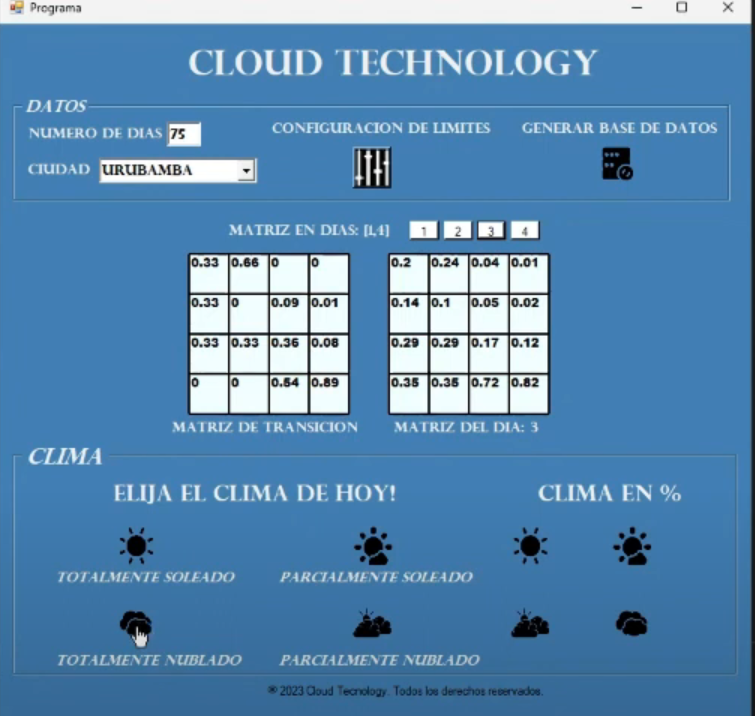
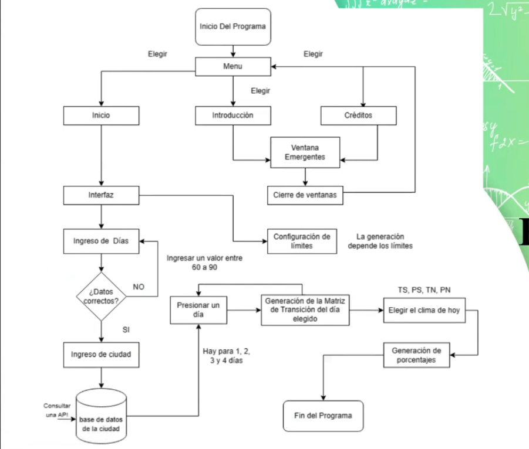

# Predicción del Clima con Cadenas de Markov

Este proyecto utiliza cadenas de Markov para predecir la nubosidad en ciudades peruanas en función de los datos climáticos de los últimos 90 días obtenidos de la API de OpenWeather y la nubosidad actual.

## Descripción del Proyecto

El proyecto utiliza la API de OpenWeather para obtener datos climáticos de ciudades peruanas seleccionadas de una lista predefinida. Los datos se procesan en Python y se almacenan en un archivo .txt. Posteriormente, los datos se leen en una aplicación de Windows Forms creada en C++.

La aplicación utiliza cadenas de Markov para calcular la probabilidad de diferentes estados climáticos (Totalmente Soleado, Parcialmente Soleado, Parcialmente Nublado, Totalmente Nublado) para los próximos 4 días. Los usuarios pueden seleccionar la cantidad de días para los que desean la predicción.

## Requisitos del Sistema

- Windows Forms (C++)
- Python
- .NET Framework

## Funcionamiento

## Configuración y Uso

1. Selecciona una ciudad de la lista predefinida.
2. La aplicación realizará una consulta a la API de OpenWeather y generará un archivo .txt con los datos climáticos de los últimos 90 días.
3. La aplicación procesará los datos y generará una matriz de transición que se muestra en la GUI.
4. Selecciona la cantidad de días para los que deseas la predicción.
5. La aplicación mostrará la predicción del clima para los días seleccionados.

#

## Contribución

Este proyecto está abierto a contribuciones. Siéntete libre de enviar un pull request.

## Licencia

Este proyecto está bajo la licencia MIT. Puedes hacer lo que quieras con él.
